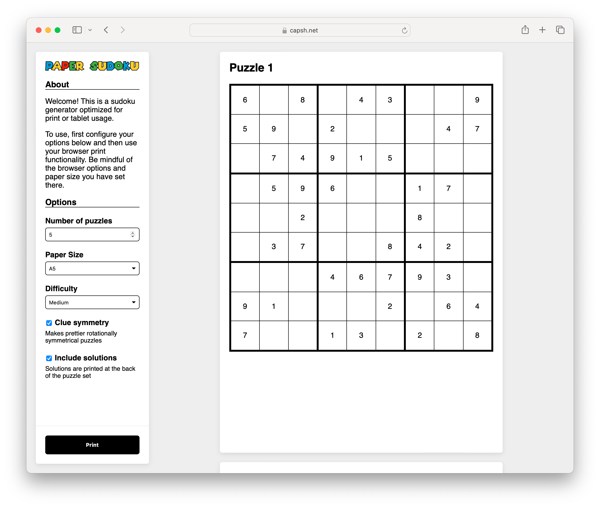

# Sudoku for Paper

## What is this?

This project is a print-focused sudoku generator. It supports quick generation of puzzles with the intention of the puzzles either being printed to paper or to PDF (for use with tablets).

This project has gone through several iterations over the decade or so that it has existed. It originally started as an online Sudoku generator, solver, and UI that allowed users to play sudoku in a browser window.



## Solver Limitations

Currently, the solver can only solve relatively simple sudoku instances that don't require backtracking or other more complex deduction strategies to solve. That is left as an exercise to the reader.

## Running the project

There is no build step for this project. I wanted to use this as an opportunity to experiment with what a modern Javascript application _could_ look like without requiring any special frameworks, libraries, or complication steps. There's some obvious downsides to this, but this project is primarily for fun and experimentation.

To develop locally, simply host this folder with whatever simple HTTP server you'd like. Locally I use Python's built in HTTP server:

```bash
python3 -m http.server
```

## Potential next steps

- Note about `/* html */`
- Testing
- Share link
- Page jumps due to removing content
- Multiple per page
- Optional build step for fun
- Dark mode support (pre-print)
- Include support for playing in browser too