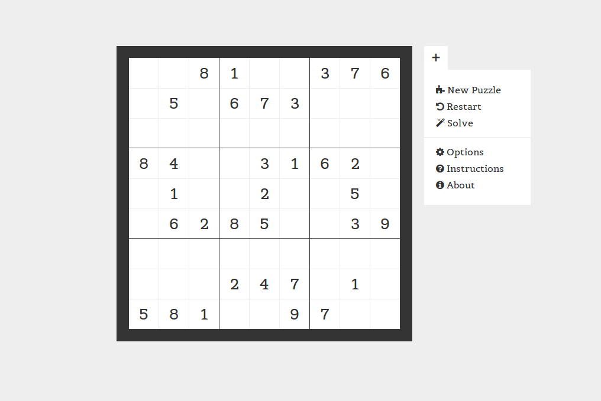

# Sudoku

A sudoku generator and solver written in javascript. Built using the javascript module design pattern and head.js.

## Solver Limitations

As of right now the solver can only solve puzzles that don't require backtracking to solve. Recursive backtracking is planned eventually, but opens up a lot of problems (puzzles need to be ensured to have exactly one solution, not many).

## Planned features

+ Generation of puzzles of varied difficulty
+ Timer and option to turn off
+ Option to input custom sudoku
+ Option to turn off viewing errors.
+ "Check" button to verify solution (mostly if errors are off)
+ Helper functionality (Give the user one filled in box)
+ Mobile/tablet friendly styling.
+ Add win state. Something should happen when you win.